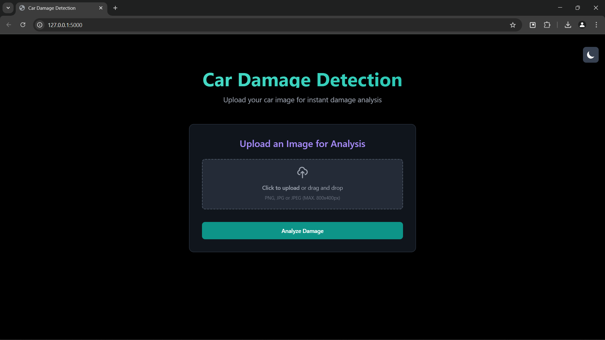
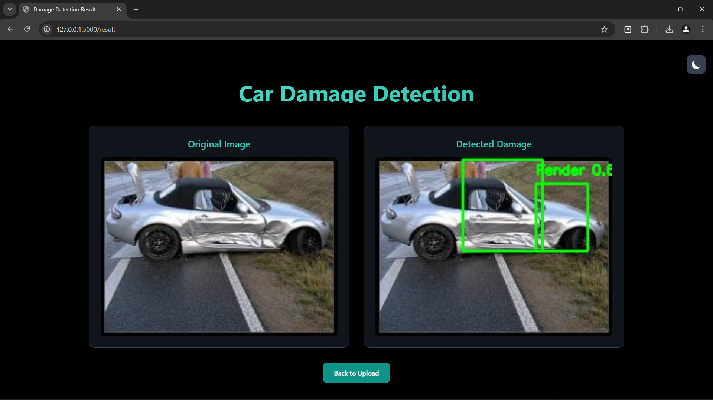

# 🚗 Car Damage Analysis 🔍

## Overview

This project implements a car damage detection system using YOLOv5 and Flask. The system analyzes images of damaged cars and identifies various types of damage, making it useful for insurance companies 🏢, car dealerships 🤝, and vehicle inspection services.

## Features

-   Real-time car damage detection using YOLOv5 🚀
-   User-friendly web interface built with Flask 🌐
-   Support for multiple damage types detection ✅
-   Easy-to-use image upload and analysis system 📤
-   Detailed damage assessment reports 📊

## Technologies Used

-   Python 
-   YOLOv5
-   Flask
-   OpenCV
-   PyTorch
-   HTML/CSS

## Setup Instructions

1.  Clone the repository:

    ```bash
    git clone https://github.com/yatharthbhatia/car-damage-analysis.git
    cd car-damage-analysis
    ```

2.  Install YOLOv5 dependencies:

    ```bash
    cd yolo
    pip install -r requirements.txt
    cd ..
    ```

3.  Download the pre-trained model weights (if not included in the repository).

4.  Run the application:

    ```bash
    python app.py
    ```

5.  Open your web browser and navigate to `http://localhost:5000` 💻

## Examples
## Application Interface

### Upload Page


### Detection Result


## Model Training

The damage detection model was trained on a custom dataset using YOLOv5. The training process included:

-   Data collection and annotation
-   Model configuration and hyperparameter tuning
-   Training on GPU infrastructure ⚡
-   Validation and testing
